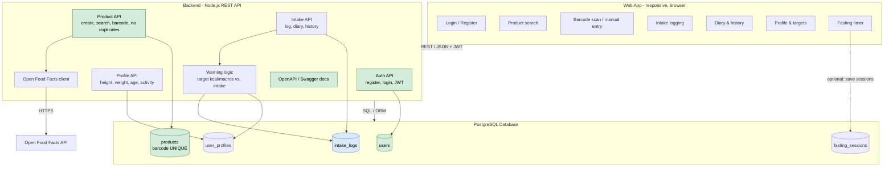

# Architecture – Commit to Fit

Web-based, responsive app (runs in the mobile browser). It talks to a
JavaScript (Node.js) backend via REST/JSON. Data is stored in PostgreSQL.
Product data can also come from Open Food Facts. The Sprint 2 scope is
highlighted in green.

```mermaid
flowchart TD
    subgraph Client [Web App - responsive, browser]
        direction TB
        C1[Login / Register]
        C2[Product search]
        C3[Barcode scan / manual entry]
        C4[Intake logging]
        C5[Diary & history]
        C6[Profile & targets]
        C7[Fasting timer]
    end

    subgraph Backend [Backend - Node.js REST API]
        direction TB
        B1[Auth API<br/>register, login, JWT]
        B2[Product API<br/>create, search, barcode, no duplicates]
        B3[Intake API<br/>log, diary, history]
        B4[Profile API<br/>height, weight, age, activity]
        B5[Warning logic<br/>target kcal/macros vs. intake]
        B6[Open Food Facts client]
        B7[OpenAPI / Swagger docs]
    end

    subgraph DB [PostgreSQL Database]
        direction TB
        D1[(users)]
        D2[(user_profiles)]
        D3[(products<br/>barcode UNIQUE)]
        D4[(intake_logs)]
        D5[(fasting_sessions)]
    end

    EXT[Open Food Facts API]

    Client -->|REST / JSON + JWT| Backend
    Backend -->|SQL / ORM| DB
    B6 -->|HTTPS| EXT

    B1 --> D1
    B2 --> D3
    B3 --> D4
    B4 --> D2
    B5 --> D2
    B5 --> D4
    B3 --> B5
    B2 --> B6
    C7 -.->|optional: save sessions| D5

    classDef sprint2 fill:#d4edda,stroke:#2e7d32,color:#000;
    classDef sprint3 fill:#dbe9f8,stroke:#2a78d6,color:#000;
    class B1,B2,B7,D1,D3 sprint2;
    class D4 sprint3;
```

## Notes
- **Multi-device:** The state lives on the server (JWT per device), so one account can be used on several devices.
- **Shared products:** `products` is global, and `barcode` is unique, so duplicates return `409`.
- **Warnings:** The backend computes the daily target from the profile (formula still open with the PO) and compares it with the sum of `intake_logs`.
- **Fasting timer:** It runs in the client. Saving sessions in `fasting_sessions` is optional, pending the PO answer.
- **Sprint 2 scope:** Auth, Product API, DB schema (`users`, `products`) and the OpenAPI docs.
- **Sprint 3 scope (database):** meal per diary entry, diary views and queries, product source for Open Food Facts (blue in the diagram).

## Backend layers (T079)

| Layer | Folder | Job | Knows SQL? |
|---|---|---|---|
| Routes | `backend/src/routes/` | HTTP: read and validate the request, choose the status code, send JSON | no |
| Middleware | `backend/src/middleware/` | JWT check (`requireAuth`), central error handling | no |
| Database access layer | `backend/src/repositories/` | All SQL queries; returns plain JavaScript objects (camelCase) | yes |
| Database connection | `backend/src/db.js` | Connection pool; `resetTables()` for tests only | – |

Repositories: `users.js` (find by id / e-mail, create), `products.js` (search with paging, find by barcode, exists, create – duplicate barcode → error with status 409), `diary.js` (intake entries, day totals, ranges, delete).

Rule: **routes and middleware never call `pool.query`**. A new query is added as a function in the matching repository and gets a test.

## Data model (status Sprint 4)

| Table / view | Columns | Notes |
|---|---|---|
| `users` | id, email, password_hash, created_at | email unique (case-insensitive) |
| `products` | id, barcode, name, brand, kcal, protein, carbs, fat, **source**, **external_id**, created_by, created_at | values per 100 g; barcode UNIQUE; `source` = `manual` or `openfoodfacts`; (source, external_id) unique |
| `intake_logs` | id, user_id, product_id, amount_g, **meal**, consumed_at, created_at | `meal` = breakfast / lunch / dinner / snack (default snack) |
| view `intake_entries` | entry + product name/brand, `day`, kcal, protein, carbs, fat | nutrients = value per 100 g × amount_g / 100 |
| view `daily_intake_totals` | user_id, day, entries, kcal, protein, carbs, fat | one row per user and day |
| `user_profiles` | **user_id** (PK → users), sex, age, height_cm, weight_kg, activity_level, goal, updated_at | one profile per user (T090); sex `male`/`female`, age 12–100, height 120–230 cm, weight 35–250 kg, activity 0–3, goal `lose`/`maintain`/`gain` |
| `fasting_sessions` | id, user_id, model, started_at, planned_end, ended_at, ramadan_first_day, ramadan_last_day, fast_from, fast_to | T092; interval models 16:8/18:6/20:4 have a planned end, Ramadan has first/last day and the daily window; `ended_at` NULL = running, only one running session per user |

### Design decisions for the diary (T049)
- **Meal on the entry:** the frontend groups the diary by meal, so `intake_logs.meal` stores it (migration `1794336000000`).
- **Calculated, not stored:** kcal and macros of an entry are calculated in the view from the product values. If a product is corrected, the diary stays consistent.
- **Day = calendar day in Vienna:** `consumed_at` is `TIMESTAMPTZ`; the day is `consumed_at AT TIME ZONE 'Europe/Vienna'`. Queries for one day use a time range on `consumed_at`, so the existing index `(user_id, consumed_at)` is used.
- **Owner only:** every query filters by `user_id`; users never see or delete entries of others.

### Diary queries (`backend/src/repositories/diary.js`, T050)
| Function | Purpose |
|---|---|
| `addEntry(userId, { productId, amountG, meal, consumedAt })` | add an entry, returns it with calculated nutrients |
| `getEntriesForDay(userId, 'YYYY-MM-DD')` | entries of one day, ordered by time |
| `getDailyTotals(userId, 'YYYY-MM-DD')` | sums of one day (zeros if empty) |
| `getTotalsForRange(userId, from, to)` | sums per day for the history |
| `getDiary(userId, 'YYYY-MM-DD')` | day totals + entries grouped by meal |
| `deleteEntry(userId, entryId)` | delete own entry |

These functions are the basis for the REST endpoints of the diary (T054). Errors carry a `statusCode` (400/404), which the central error handler returns.

Tests: `backend/tests/diary.test.js` (T052). Demo data: `npm run seed` adds a 7-day diary for `demo@commit2fit.test` (T058).

### Profiles and fasting sessions (T090–T092, Sprint 4)
Profile and fasting timer were only stored in the browser (localStorage), so they were not the same on a second device (F11).

| Function | Purpose |
|---|---|
| `getProfile(userId)` | profile or `null` |
| `saveProfile(userId, profile)` | create or replace the profile (one per user); 400 for invalid values |
| `startSession(userId, { model, startedAt?, firstDay?, lastDay?, from?, to? })` | start a fasting session; planned end = start + 16/18/20 h; Ramadan needs first/last day and from/to; a second running session → 409 |
| `getActiveSession(userId)` | running session or `null` |
| `endSession(userId, endedAt?)` | stop the running session (never before its start) |
| `listSessions(userId, limit?)` | history, newest first |

The field names of the profile are the ones the frontend already uses in `frontend/js/api.js` (T097): `sex`, `age`, `height`, `weight`, `activityLevel`, `goal`.
The REST endpoints `GET/PUT /profile` and the fasting endpoints still have to be added on top of these functions (hand-over, see T093).

Tests: `backend/tests/profiles.test.js`, `backend/tests/fasting.test.js`. `npm run seed` also adds a demo profile for `demo@commit2fit.test`.
